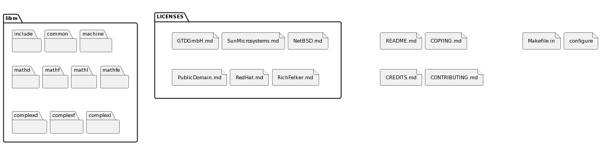
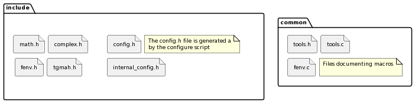
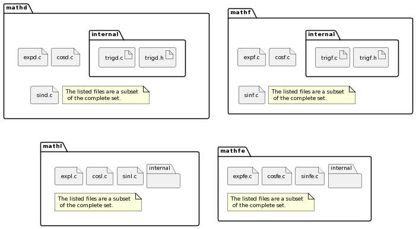
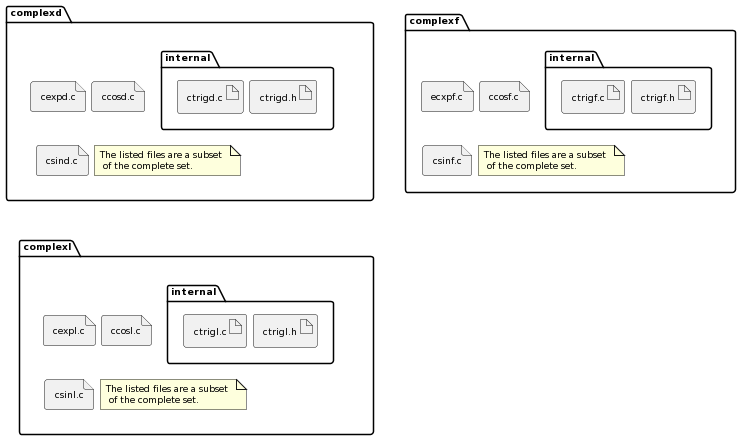

Overall Architecture
--------------------

.. raw:: html

   <!--
   a. The SDD shall describe the software architectural design, from a static point of view and also, when the software to be developed has real time constraints, from a dynamic point of view, and from a behaviour point of view.
   b. The software static architecture shall be summarized describing its components.
   c. For real–time software, the software dynamic architecture shall be summarized describing its selected computational model.
       NOTE: An analysable computational model generally consists in defining:
           * the types of components (objects) participating to the real‐time behaviour, from which the system is constructed (e.g. active‐periodic, active‐sporadic, protected,passive, actors, process, blocks, drivers)
           * the scheduling type (e.g. sequential or multithreaded), the scheduling model (e.g. cyclic or pre‐emptive, fixed or dynamic priority based), and the analytical model (e.g. Rate Monotonic Scheduling, Deadline Monotonic Scheduling, Earliest Deadline First), under which the system is executed and its associated mechanisms
           * the means of communication between components/objects (e.g. mailboxes, entry parameters)
           * the means of synchronization between components or objects (e.g. mutual exclusion, protected object entries, basic semaphores)
           * If applicable , the means of distribution and internode communication (e.g. virtual nodes, Remote Procedure Call)

       and (optional for non flight software):

           * the means of providing timing facilities (e.g. real clock, with or without interrupt, multiple interrupting count‐down, relative or absolute delays, timers time‐out)
           * the means of providing asynchronous transfer of control (e.g. watchdog to transfer control from anywhere to the reset sequence, software service of the underlying run‐time system to cause transfer of control within the local scope of the thread)

   d. The description in <5.2>c. should consist in the following information:
       1. type of components participating to the real time behaviour,
       2. scheduling type (e.g. single or multi–threads),
       3. scheduling model (e.g. pre–emptive or not, fixed or dynamic priority based),
       4. analytical model (e.g. rate monotonic scheduling, deadline monotonic scheduling),
       5. Tasks identification and priorities,
       6. Means of communication and synchronization,
       7. Time management.
   e. The software behaviour shall be described e.g. with automata or scenarios.
   f. The software static, dynamic and behavioural architecture shall be described in accordance with the selected design method.
   g. The SDD shall describe the error handling and fault tolerance principles (e.g. error detection, reporting, logging, and fault containment regions.)
   -->

One of the project’s goals is having an easy access to all of the library’s procedures. To attain this goal, only the header files ``math.h`` and ``complex.h`` (if complex procedures are wanted by the given project) have to be included to use all the mathematical procedures provided by the library. These header files contain all procedure definitions, while their implementation can be found in separate ``.c`` files.

A further difference to other projects is the definition of a software component. In most other projects, this library would be considered as one single component, but in the context of describing the library a component/unit is one procedure, e.g. ``sin``, ``sinf``, ``sinl``, ``cos``, ``cosf``, ``cosl``, ``atan2``, &c. Most of the procedures are implemented in one or more separate translation units. The following procedures are accessible (the list contains the names of the double precision procedures, the single precision procedure names are the same but suffixed with an ``f``, the long double precision procedure names are the same but suffixed with an ``l``):

.. table:: List of all procedures in math.h
   :name: List of math procedures

   +--------------------+-----------------------------------------------------------+
   | Procedure          | Description                                               |
   +====================+===========================================================+
   | ``fpclassify``     | Procedure returning the classification of the argument    |
   +--------------------+-----------------------------------------------------------+
   | ``isfinite``       | Procedure returning whether the value of the argument is  |
   |                    | finite or not (not :math:`±Inf` and not :math:`NaN`)      |
   +--------------------+-----------------------------------------------------------+
   | ``isinf``          | Procedure returning whether the value of the argument is  |
   |                    | positive or negative Infinity or not                      |
   +--------------------+-----------------------------------------------------------+
   | ``isnan``          | Procedure returning whether the argument is a             |
   |                    | :math:`NaN` floating-point value or not                   |
   +--------------------+-----------------------------------------------------------+
   | ``isnormal``       | Procedure returning whether the argument is a normal      |
   |                    | floating-point value or not                               |
   +--------------------+-----------------------------------------------------------+
   | ``signbit``        | Procedure returning whether the argument is negative or   |
   |                    | not                                                       |
   +--------------------+-----------------------------------------------------------+
   | ``acos``           | Procedure returning the trigonometric arccosine           |
   +--------------------+-----------------------------------------------------------+
   | ``asin``           | Procedure returning the trigonometric arcsine             |
   +--------------------+-----------------------------------------------------------+
   | ``atan``           | Procedure returning the trigonometric arctangent          |
   +--------------------+-----------------------------------------------------------+
   | ``atan2``          | Procedure returning the trigonometric arctangent of       |
   |                    | :math:`\frac{y}{x}`                                       |
   +--------------------+-----------------------------------------------------------+
   | ``cos``            | Procedure returning the trigonometric cosine              |
   +--------------------+-----------------------------------------------------------+
   | ``sin``            | Procedure returning the trigonometric sine                |
   +--------------------+-----------------------------------------------------------+
   | ``tan``            | Procedure returning the trigonometric tangent             |
   +--------------------+-----------------------------------------------------------+
   | ``acosh``          | Procedure returning the hyperbolic arccosine              |
   +--------------------+-----------------------------------------------------------+
   | ``asinh``          | Procedure returning the hyperbolic arcsine                |
   +--------------------+-----------------------------------------------------------+
   | ``atanh``          | Procedure returning the hyperbolic arctangent             |
   +--------------------+-----------------------------------------------------------+
   | ``cosh``           | Procedure returning the hyperbolic cosine                 |
   +--------------------+-----------------------------------------------------------+
   | ``sinh``           | Procedure returning the hyperbolic sine                   |
   +--------------------+-----------------------------------------------------------+
   | ``tanh``           | Procedure returning the hyperbolic tangent                |
   +--------------------+-----------------------------------------------------------+
   | ``exp``            | Procedure returning the base :math:`e` exponential of     |
   |                    | :math:`x`                                                 |
   +--------------------+-----------------------------------------------------------+
   | ``exp2``           | Procedure returning the base :math:`2` exponential of     |
   |                    | :math:`x`                                                 |
   +--------------------+-----------------------------------------------------------+
   | ``expm1``          | Procedure returning the base :math:`e` exponential of     |
   |                    | :math:`x` minus :math:`1`                                 |
   +--------------------+-----------------------------------------------------------+
   | ``frexp``          | Procedure breaking :math:`x` into a normalized fraction   |
   |                    | and an integral power of :math:`2`                        |
   +--------------------+-----------------------------------------------------------+
   | ``ilogb``          | Procedure returning the binary exponent of :math:`x` as   |
   |                    | integer                                                   |
   +--------------------+-----------------------------------------------------------+
   | ``ldexp``          | Procedure returning :math:`x` multiplied by an integral   |
   |                    | power of :math:`2`                                        |
   +--------------------+-----------------------------------------------------------+
   | ``log``            | Procedure returning the natural logarithm                 |
   +--------------------+-----------------------------------------------------------+
   | ``log10``          | Procedure returning the base :math:`10` logarithm         |
   +--------------------+-----------------------------------------------------------+
   | ``log1p``          | Procedure returning the natural logarithm of              |
   |                    | :math:`x + 1`                                             |
   +--------------------+-----------------------------------------------------------+
   | ``log2``           | Procedure returning the base :math:`2` logarithm          |
   +--------------------+-----------------------------------------------------------+
   | ``logb``           | Procedure returning the binary exponent of :math:`x`      |
   +--------------------+-----------------------------------------------------------+
   | ``modf``           | Procedure breaking :math:`x` in its integral and          |
   |                    | fractional part                                           |
   +--------------------+-----------------------------------------------------------+
   | ``scalbn``         | Procedure returning :math:`x` multiplied by an integral   |
   |                    | power of :math:`2`                                        |
   +--------------------+-----------------------------------------------------------+
   | ``scalbln``        | Procedure returning :math:`x` multiplied by an integral   |
   |                    | power of :math:`2`                                        |
   +--------------------+-----------------------------------------------------------+
   | ``cbrt``           | Procedure returning the cubic root                        |
   +--------------------+-----------------------------------------------------------+
   | ``fabs``           | Procedure returning the absolute value                    |
   +--------------------+-----------------------------------------------------------+
   | ``hypot``          | Procedure returning the square root of :math:`x^2+y^2`    |
   +--------------------+-----------------------------------------------------------+
   | ``pow``            | Procedure returning :math:`x` raised to the power of      |
   |                    | :math:`y`                                                 |
   +--------------------+-----------------------------------------------------------+
   | ``sqrt``           | Procedure returning the square root                       |
   +--------------------+-----------------------------------------------------------+
   | ``erf``            | Procedure returning the error function                    |
   +--------------------+-----------------------------------------------------------+
   | ``erfc``           | Procedure returning the complementary error function      |
   |                    | (``erfc`` = :math:`1 -` ``erf``)                          |
   +--------------------+-----------------------------------------------------------+
   | ``lgamma``         | Procedure returning the natural logarithm of the absolute |
   |                    | value of gamma of :math:`x`                               |
   +--------------------+-----------------------------------------------------------+
   | ``tgamma``         | Procedure returning gamma function of :math:`x`           |
   +--------------------+-----------------------------------------------------------+
   | ``ceil``           | Procedure for rounding upwards to the nearest integer     |
   +--------------------+-----------------------------------------------------------+
   | ``floor``          | Procedure for rounding downwards to the nearest integer   |
   +--------------------+-----------------------------------------------------------+
   | ``nearbyint``      | Procedure for rounding to the nearest integer using the   |
   |                    | current rounding direction                                |
   +--------------------+-----------------------------------------------------------+
   | ``rint``           | Procedure for rounding to the nearest integer using the   |
   |                    | current rounding direction (raises inexact)               |
   +--------------------+-----------------------------------------------------------+
   | ``lrint``          | Procedure for rounding to the nearest integer using the   |
   |                    | current rounding direction                                |
   +--------------------+-----------------------------------------------------------+
   | ``llrint``         | Procedure for rounding to the nearest integer using the   |
   |                    | current rounding direction                                |
   +--------------------+-----------------------------------------------------------+
   | ``round``          | Procedure for rounding to the nearest integer (Halfway    |
   |                    | values rounded away from :math:`0`)                       |
   +--------------------+-----------------------------------------------------------+
   | ``lround``         | Procedure for rounding to the nearest integer (Halfway    |
   |                    | values rounded away from :math:`0`)                       |
   +--------------------+-----------------------------------------------------------+
   | ``llround``        | Procedure for rounding to the nearest integer (Halfway    |
   |                    | values rounded away from :math:`0`)                       |
   +--------------------+-----------------------------------------------------------+
   | ``trunc``          | Procedure for rounding towards :math:`0` to the nearest   |
   |                    | integer                                                   |
   +--------------------+-----------------------------------------------------------+
   | ``fmod``           | Procedure returning the floating-point remainder of       |
   |                    | :math:`\frac{y}{x}` (rounded towards zero)                |
   +--------------------+-----------------------------------------------------------+
   | ``remainder``      | Procedure returning the floating-point remainder of       |
   |                    | :math:`\frac{y}{x}` (rounded to nearest integral value)   |
   +--------------------+-----------------------------------------------------------+
   | ``remquo``         | Procedure returning the same value as ``remainder`` and   |
   |                    | puts the quotient in :math:`*quo`                         |
   +--------------------+-----------------------------------------------------------+
   | ``copysign``       | Procedure returning a floating-point number with the      |
   |                    | magnitude of :math:`x` and the sign of :math:`y`          |
   +--------------------+-----------------------------------------------------------+
   | ``nan``            | Procedure returning a :math:`NaN`                         |
   +--------------------+-----------------------------------------------------------+
   | ``nextafter``      | Procedure returning the next floating-point value after   |
   |                    | :math:`x` in direction of :math:`y`                       |
   +--------------------+-----------------------------------------------------------+
   | ``nexttoward``     | Procedure returning the next floating-point value after   |
   |                    | :math:`x` in direction of :math:`y`                       |
   +--------------------+-----------------------------------------------------------+
   | ``fdim``           | Procedure returning the positive difference between the   |
   |                    | arguments                                                 |
   +--------------------+-----------------------------------------------------------+
   | ``fmax``           | Procedure returning the larger of two values              |
   +--------------------+-----------------------------------------------------------+
   | ``fmin``           | Procedure returning the smaller of two values             |
   +--------------------+-----------------------------------------------------------+
   | ``fma``            | Procedure returning the result of :math:`x \cdot y + z`   |
   +--------------------+-----------------------------------------------------------+
   | ``isgreater``      | Procedure returning whether :math:`x` is greater than     |
   |                    | :math:`y`                                                 |
   +--------------------+-----------------------------------------------------------+
   | ``isgreaterequal`` | Procedure returning whether :math:`x` is greater than or  |
   |                    | equal to :math:`y`                                        |
   +--------------------+-----------------------------------------------------------+
   | ``isless``         | Procedure returning whether :math:`x` is less than        |
   |                    | :math:`y`                                                 |
   +--------------------+-----------------------------------------------------------+
   | ``islessequal``    | Procedure returning whether :math:`x` is less than or     |
   |                    | equal to :math:`y`                                        |
   +--------------------+-----------------------------------------------------------+
   | ``islessgreater``  | Procedure returning whether :math:`x` is less or greater  |
   |                    | than :math:`y`                                            |
   +--------------------+-----------------------------------------------------------+
   | ``isunordered``    | Procedure returning whether the arguments are unordered   |
   |                    | (aka at least one is :math:`NaN`)                         |
   +--------------------+-----------------------------------------------------------+
   | ``j0``             | Procedure returning the Bessel value of :math:`x` of the  |
   |                    | first kind of order :math:`0`                             |
   +--------------------+-----------------------------------------------------------+
   | ``j1``             | Procedure returning the Bessel value of :math:`x` of the  |
   |                    | first kind of order :math:`1`                             |
   +--------------------+-----------------------------------------------------------+
   | ``jn``             | Procedure returning the Bessel value of :math:`x` of the  |
   |                    | first kind of order :math:`n`                             |
   +--------------------+-----------------------------------------------------------+
   | ``y0``             | Procedure returning the Bessel value of :math:`x` of the  |
   |                    | second kind of order :math:`0`                            |
   +--------------------+-----------------------------------------------------------+
   | ``y1``             | Procedure returning the Bessel value of :math:`x` of the  |
   |                    | second kind of order :math:`1`                            |
   +--------------------+-----------------------------------------------------------+
   | ``yn``             | Procedure returning the Bessel value of :math:`x` of the  |
   |                    | second kind of order :math:`n`                            |
   +--------------------+-----------------------------------------------------------+

.. table:: List of all procedures in complex.h
   :name: List of complex procedures

   +--------------------+-----------------------------------------------------------+
   | Procedure          | Description                                               |
   +====================+===========================================================+
   | ``cacos``          | Procedure returning the complex trigonometric arccosine   |
   +--------------------+-----------------------------------------------------------+
   | ``casin``          | Procedure returning the complex trigonometric arcsine     |
   +--------------------+-----------------------------------------------------------+
   | ``catan``          | Procedure returning the complex trigonometric arctangent  |
   +--------------------+-----------------------------------------------------------+
   | ``ccos``           | Procedure returning the complex trigonometric cosine      |
   +--------------------+-----------------------------------------------------------+
   | ``csin``           | Procedure returning the complex trigonometric sine        |
   +--------------------+-----------------------------------------------------------+
   | ``ctan``           | Procedure returning the complex trigonometric tangent     |
   +--------------------+-----------------------------------------------------------+
   | ``cacosh``         | Procedure returning the complex hyperbolic arccosine      |
   +--------------------+-----------------------------------------------------------+
   | ``casinh``         | Procedure returning the complex hyperbolic arcsine        |
   +--------------------+-----------------------------------------------------------+
   | ``catanh``         | Procedure returning the complex hyperbolic arctangent     |
   +--------------------+-----------------------------------------------------------+
   | ``ccosh``          | Procedure returning the complex hyperbolic cosine         |
   +--------------------+-----------------------------------------------------------+
   | ``csinh``          | Procedure returning the complex hyperbolic sine           |
   +--------------------+-----------------------------------------------------------+
   | ``ctanh``          | Procedure returning the complex hyperbolic tangent        |
   +--------------------+-----------------------------------------------------------+
   | ``cexp``           | Procedure returning the complex base :math:`e`            |
   |                    | exponential of :math:`z`                                  |
   +--------------------+-----------------------------------------------------------+
   | ``clog``           | Procedure returning the complex natural logarithm         |
   +--------------------+-----------------------------------------------------------+
   | ``cabs``           | Procedure returning the complex absolute value            |
   +--------------------+-----------------------------------------------------------+
   | ``cpow``           | Procedure returning the complex value :math:`x` raised to |
   |                    | the power of :math:`y`                                    |
   +--------------------+-----------------------------------------------------------+
   | ``csqrt``          | Procedure returning the complex square root               |
   +--------------------+-----------------------------------------------------------+
   | ``carg``           | Procedure returning the value of :math:`z` in the         |
   |                    | interval [:math:`-\pi`, :math:`+\pi`]                     |
   +--------------------+-----------------------------------------------------------+
   | ``cimag``          | Procedure returning the imaginary part of the value of    |
   |                    | :math:`z`                                                 |
   +--------------------+-----------------------------------------------------------+
   | ``CMPLX``          | Procedure returning the complex value with real part      |
   |                    | :math:`x` and imaginary part :math:`y`                    |
   +--------------------+-----------------------------------------------------------+
   | ``conj``           | Procedure returning the complex conjugate value of        |
   |                    | :math:`z`                                                 |
   +--------------------+-----------------------------------------------------------+
   | ``cproj``          | Procedure returning the value of the projection onto the  |
   |                    | Riemann sphere of :math:`z`                               |
   +--------------------+-----------------------------------------------------------+
   | ``creal``          | Procedure returning the real part of the value of         |
   |                    | :math:`z`                                                 |
   +--------------------+-----------------------------------------------------------+

Furthermore the library shall provide a number of constants, as such the following defines are to be added to ``math.h``:

.. table:: List of all constant defines in math.h
   :name: List of math constants

   ================ ===============================================
   Name             Description
   ================ ===============================================
   ``M_E``          Value of :math:`e`
   ``M_LOG2E``      Value of :math:`log_{2} e`
   ``M_LOG10E``     Value of :math:`log_{10} e`
   ``M_LN2``        Value of :math:`log_e 2`
   ``M_LN10``       Value of :math:`log_e 10`
   ``M_PI``         Value of :math:`\pi`
   ``M_PI_2``       Value of :math:`\frac{\pi}{2}`
   ``M_PI_4``       Value of :math:`\frac{\pi}{4}`
   ``M_1_PI``       Value of :math:`\frac{1}{\pi}`
   ``M_2_PI``       Value of :math:`\frac{2}{\pi}`
   ``M_2_SQRTPI``   Value of :math:`\frac{2}{\sqrt{\pi}}`
   ``M_SQRT2``      Value of :math:`\sqrt{2}`
   ``M_SQRT1_2``    Value of :math:`\sqrt{\frac{1}{2}}`
   ``HUGE_VAL``     Value of :math:`+Inf` (double)
   ``HUGE_VALF``    Value of :math:`+Inf` (float)
   ``INFINITY``     Value of :math:`+Inf`
   ``NAN``          Value of :math:`NaN`
   ``MAXFLOAT``     Synonym of ``FLT_MAX``
   ``FP_INFINITE``  :math:`1`
   ``FP_NAN``       :math:`0`
   ``FP_NORMAL``    :math:`4`
   ``FP_SUBNORMAL`` :math:`3`
   ``FP_ZERO``      :math:`2`
   ``FP_ILOGB0``    Value to return for :ref:`ilogb` (:math:`0`)
   ``FP_ILOGBNAN``  Value to return for :ref:`ilogb` (:math:`NaN`)
   ================ ===============================================

*Remark:* Both ``INFINITY`` and ``NAN`` expand to floats or doubles depending on the context.

Directory Structure and Naming Scheme
~~~~~~~~~~~~~~~~~~~~~~~~~~~~~~~~~~~~~

   Folder structure

The :numref:`Fig. %s <static-architecture>` shows the planned directory and file structure for the ``libm``. As can be seen in the figure the main directory of the ``LibmCS`` will contain eight elements:

-  the library contents are in ``libm``,
-  the licenses of all files are in ``LICENSES``,
-  the combined license file for the library ``COPYING.md``, 
-  the credits to the main contributors are in ``CREDITS.md``,
-  the explanations on how to contribute to the library are in ``CONTRIBUTING.md``,
-  the ``configure`` script to configure the library,
-  the ``Makefile`` to build the library, and finally 
-  there is a ``README.md`` containing general information about the library.

The ``libm`` directory contains four types of subdirectories:

-  ``include``: This directory contains the header files available to the users.
-  ``common``: This directory contains helper functionalities which are used by many library files, for example macros to easily switch between floating-point datums and their integer representation.
-  ``math/complex/d/f/l/fe``: These directories contain the implementation files of the mathematical functions. They are named after the header file they cater to and a suffix for the type they contain. Possible suffixes are ``d`` for ``double``-type procedures, ``f`` for ``float``-type procedures, ``fe`` for ``float``-type procedures which use ``double``-type variables/procedures as part of their implementation (thus called ``float-extended``), and ``l`` for ``long double``-type procedures. Some procedures use multiple types for their inputs/outputs but usually have a proper place in this setup; refer to :ref:`Software Components Design – Aspects of Each Component` to see where each file is placed. These directories furthermore each contain an ``internal`` directory which will be used for internal functions which are used by multiple similar functions (e.g., range reduction functions for the trigonometric procedures). Internal functions which are only used by a single function will be placed in their parent function’s file.
-  ``machine``: This directory is meant to be used for machine (hardware/toolchain) specific implementations of library functions. In this activity there will only be an example such that the user may include their own implementations for their machine.

The ``LICENSES`` directory contains a file for each individual license used within the library. All library files contain an :ref:`SPDX <ABBR>`-license-identifier to refer to the licenses within this directory.

   Folders include and common

   Real procedures

   Complex procedures

The C-Functions directly representing a required procedure are named the same as the procedure (e.g., ``asin``, ``asinf``, ``asinl``). The same applies to their filenames with the exception of the ``double``-type versions which have an additional ``d`` suffix (e.g., ``asind.c``), and the ``float-extended``-type which add an ``e`` to the already existing ``f`` suffix.

Internal procedures shall be named after the procedure they are mainly called by prefixed with a double underscore (e.g., ``__asin``). There is a bit more freedom in the case of multiple internal functions, but all should at least contain the double underscore prefix as well as the procedure name (in some cases it might make sense to use a conglomerate instead of a specific procedure e.g. use ``__trig_rempio2`` for the range reduction function for all trigonometric procedures). The same freedom is given for naming the files containing internal functions: the name should represent the content (e.g., ``trig.c`` contains the internal procedures used by both ``sin`` and ``cos`` as well as the range reduction function used by all three trigonometric functions).

If the user were to add a separate implementation for a procedure, we suggest to add another suffix using an underscore (e.g., ``expd_table.c`` for a table based implementation of the ``exp`` procedure). Choosing between implementations should be done with changes to the ``Makefile``.
